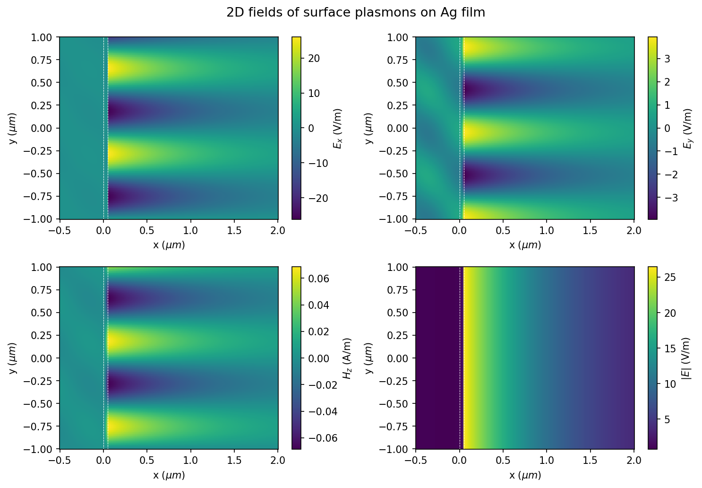
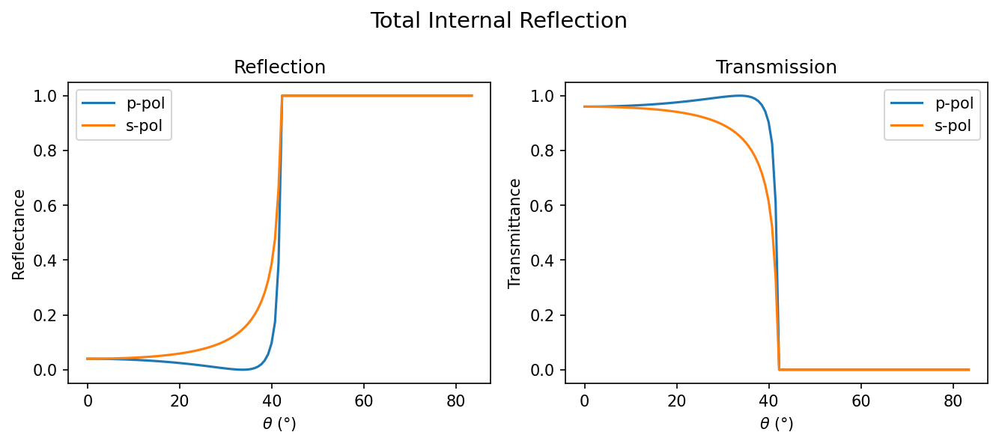
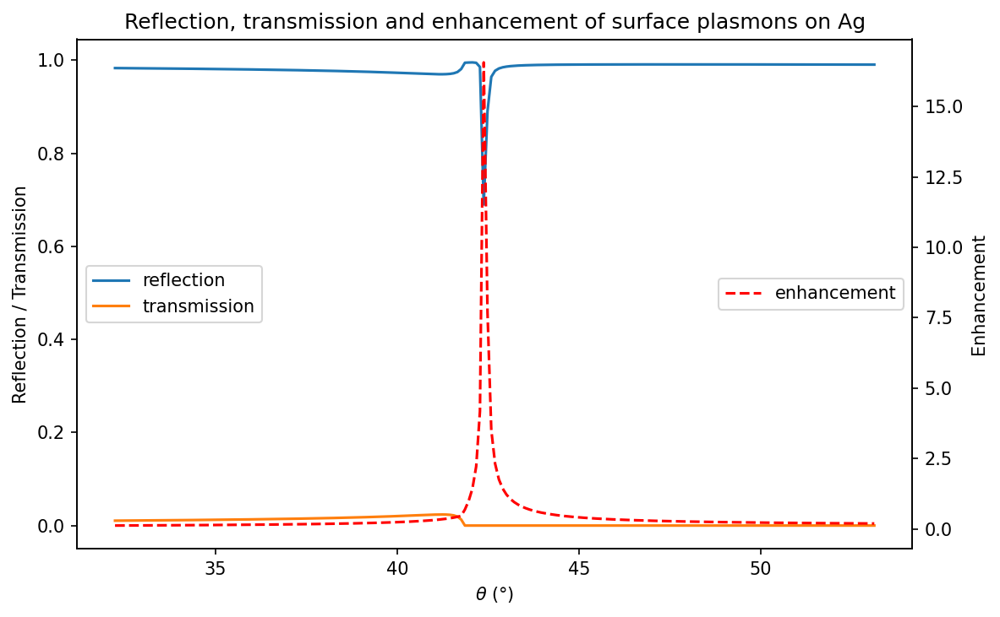
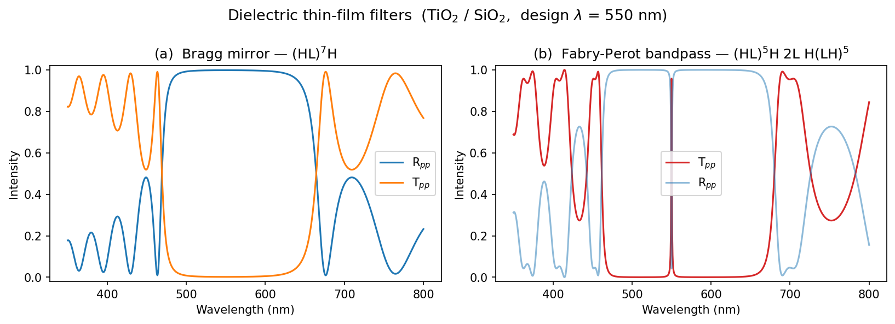
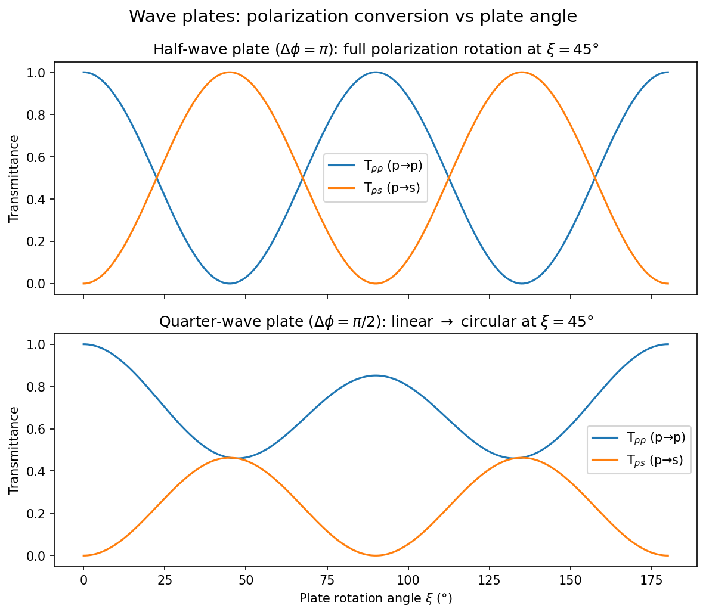
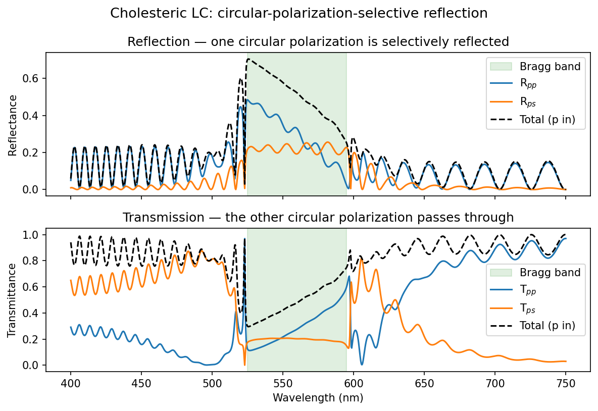
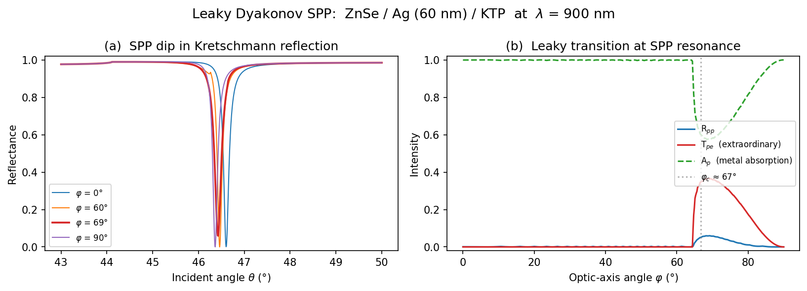

[](https://badge.fury.io/py/GeneralTmm)
[](https://pypi.org/project/GeneralTmm/)
[](https://opensource.org/licenses/MIT)
[](https://github.com/ardiloot/GeneralTmm/actions/workflows/pytest.yml)
[](https://github.com/ardiloot/GeneralTmm/actions/workflows/pre-commit.yml)
[](https://github.com/ardiloot/GeneralTmm/actions/workflows/publish-to-pypi.yml)

# General 4×4 Transfer-Matrix Method (TMM)

A Python library for optical simulations of **isotropic and anisotropic multilayer structures** using the 4×4 transfer-matrix method (Hodgkinson, Kassam & Wu, 1997).

<p align="center">
  
</p>

> **See also:** [NonlinearTMM](https://github.com/ardiloot/NonlinearTMM) — extends TMM to **nonlinear processes** (SHG, SFG, DFG) and **Gaussian beam propagation** in layered structures.

## Table of Contents

- [Features](#features)
- [Installation](#installation)
- [API Overview](#api-overview)
- [Examples](#examples)
  - [Total Internal Reflection](#total-internal-reflection--exampletirpy)
  - [Surface Plasmon Polaritons](#surface-plasmon-polaritons--examplespppy)
  - [Dielectric Thin-Film Filters](#dielectric-thin-film-filters--examplefilterpy)
  - [Wave Plates](#wave-plates--exampleanisotropicpy)
  - [Cholesteric Liquid Crystal](#cholesteric-liquid-crystal--examplecholestericpy)
  - [Leaky Dyakonov SPP](#leaky-dyakonov-spp--exampledspppy)
- [References](#references)
- [Development](#development)
  - [Setup](#setup)
  - [Running tests](#running-tests)
  - [Code formatting and linting](#code-formatting-and-linting)
  - [CI overview](#ci-overview)
- [Releasing](#releasing)
- [License](#license)

## Features

- **Isotropic and anisotropic (birefringent) layers** — full 4×4 matrix for uniaxial/biaxial crystals with arbitrary orientation
- **Parameter sweeps** — over wavelength, angle (β), layer thickness, refractive index, and crystal rotation angles
- **1D and 2D electromagnetic field profiles** — E and H field distributions through the structure
- **Field enhancement and optimization** — built-in simplex optimizer to find resonance conditions (e.g. SPP)
- **Wavelength-dependent materials** — interpolated from measured optical data
- **Cross-polarization coefficients** — R₁₂, R₂₁, T₃₂, T₄₁ for polarization coupling in anisotropic media
- **High performance** — C++ core (Eigen) with Cython bindings
- **Cross-platform wheels** — Linux, Windows, macOS; Python 3.10–3.14

## Installation

```bash
pip install GeneralTmm
```

Pre-built wheels are available for most platforms. A C++ compiler is only needed when installing from source.

## API Overview

The library exposes two classes: `Material` and `Tmm`.

| Class / method | Purpose |
|---|---|
| `Material(wls, ns)` | Wavelength-dependent material from arrays of λ and complex n |
| `Material.Static(n)` | Constant refractive index (shortcut) |
| `Tmm(wl=…, beta=…)` | Create a solver; `wl` = wavelength (m), `beta` = n sin θ |
| `tmm.AddIsotropicLayer(d, mat)` | Append isotropic layer (`d` in m, `inf` for semi-infinite) |
| `tmm.AddLayer(d, matX, matY, matZ, psi, xi)` | Append anisotropic layer with crystal orientation angles |
| `tmm.Sweep(param, values)` | Solve for an array of values of any parameter; returns dict-like results (`R11`, `R22`, `R12`, `T31`, …) |
| `tmm.CalcFields1D(xs, pol)` | E, H field profiles along the layer normal |
| `tmm.CalcFields2D(xs, ys, pol)` | E, H on a 2-D grid |
| `tmm.OptimizeEnhancement(…)` | Simplex optimizer for field enhancement |

Coordinate system (Hodgkinson convention): **x** = layer normal / propagation direction, **y** and **z** = in-plane, plane of incidence = xz. Crystal rotation angles: **ψ** around z, **ξ** around x.

## Examples

### Total Internal Reflection — [ExampleTIR.py](Examples/ExampleTIR.py)

Simulate total internal reflection at a glass/air interface:

```python
import numpy as np
from GeneralTmm import Tmm, Material

# Materials: glass prism and air
prism = Material.Static(1.5)
substrate = Material.Static(1.0)

# Set up TMM solver at 532 nm wavelength
tmm = Tmm(wl=532e-9)
tmm.AddIsotropicLayer(float("inf"), prism)      # semi-infinite prism
tmm.AddIsotropicLayer(float("inf"), substrate)   # semi-infinite air

# Sweep over effective mode index beta = n * sin(theta)
betas = np.linspace(0.0, 1.49, 100)
result = tmm.Sweep("beta", betas)

# Reflection coefficients for p- and s-polarization
R_p = result["R11"]  # p → p reflection
R_s = result["R22"]  # s → s reflection
```

<p align="center">
  
</p>

### Surface Plasmon Polaritons — [ExampleSPP.py](Examples/ExampleSPP.py)

Kretschmann configuration (glass | 50 nm Ag | air) with wavelength-dependent silver data (Johnson & Christy, 1972). Demonstrates reflection sweeps, enhancement optimization, and 1D/2D field visualization.

<p align="center">
  
</p>

### Dielectric Thin-Film Filters — [ExampleFilter.py](Examples/ExampleFilter.py)

Quarter-wave stacks of TiO₂ / SiO₂ on BK7 glass at normal incidence. A Bragg mirror (HL)⁷H gives > 99.8 % reflectance across a ~160 nm stop band centered at 550 nm. Adding a half-wave SiO₂ cavity between two such mirrors creates a Fabry-Perot bandpass filter with a narrow transmission peak.

<p align="center">
  
</p>

### Wave Plates — [ExampleAnisotropic.py](Examples/ExampleAnisotropic.py)

Half-wave and quarter-wave plates simulated as birefringent slabs (Δn = 0.1) at normal incidence. Sweeps the plate rotation angle ξ to show how a HWP fully converts p- to s-polarization at 45°, while a QWP produces circular polarization. A textbook result verified with the full 4×4 method.

<p align="center">
  
</p>

### Cholesteric Liquid Crystal — [ExampleCholesteric.py](Examples/ExampleCholesteric.py)

A helical stack of birefringent layers acts as a circular-polarization-selective Bragg reflector: one handedness is reflected in a well-defined wavelength band while the other is transmitted. This is the mechanism behind structurally colored beetle shells and cholesteric LC displays. Also a good stress test of the 4×4 method with hundreds of anisotropic layers.

<p align="center">
  
</p>

### Leaky Dyakonov SPP — [ExampleDSPP.py](Examples/ExampleDSPP.py)

A Kretschmann-coupled surface plasmon polariton at an Ag / KTP birefringent-crystal interface. When the crystal optic axis is tilted past a critical angle φ<sub>c</sub> ≈ 67°, the extraordinary wave begins to propagate and up to 36 % of the incident p-polarized light tunnels through the 60 nm silver film — the "leaky Dyakonov SPP" regime (Loot & Hizhnyakov, 2016).

<p align="center">
  
</p>

## References

> Hodgkinson, I. J., Kassam, S., & Wu, Q. H. (1997). Eigenequations and Compact Algorithms for Bulk and Layered Anisotropic Optical Media: Reflection and Refraction at a Crystal-Crystal Interface. *Journal of Computational Physics*, 133(1), 75–83.
>
> Johnson, P. B., & Christy, R. W. (1972). Optical Constants of the Noble Metals. *Physical Review B*, 6(12), 4370–4379.
>
> Loot, A., & Hizhnyakov, V. (2016). Leaky Dyakonov surface plasmon polaritons for birefringent crystals. *Applied Physics A*, 122, 327.

## Development

### Setup

```bash
git clone https://github.com/ardiloot/GeneralTmm.git
cd GeneralTmm

# Install uv if not already installed:
# https://docs.astral.sh/uv/getting-started/installation/

# Create venv, build the C++ extension, and install all dependencies
uv sync
```

### Running tests

```bash
uv run pytest -v
```

### Code formatting and linting

[Pre-commit](https://pre-commit.com/) hooks are configured to enforce formatting (ruff, clang-format) and catch common issues. To install the git hook locally:

```bash
uvx pre-commit install
```

To run all checks manually:

```bash
uvx pre-commit run --all-files
```

### Regenerating README images

```bash
uv run python docs/generate_images.py
```

### CI overview

| Workflow | Trigger | What it does |
|----------|---------|-------------|
| [Pytest](.github/workflows/pytest.yml) | Push to `master` / PRs | Tests on {ubuntu, windows, macos} × Python {3.10 – 3.14} |
| [Pre-commit](.github/workflows/pre-commit.yml) | Push to `master` / PRs | Runs ruff, clang-format, and other checks |
| [Publish to PyPI](.github/workflows/publish-to-pypi.yml) | Release published | Builds wheels + sdist via cibuildwheel, uploads to PyPI |
| [Dependabot](.github/dependabot.yml) | Weekly | Keeps GitHub Actions and pip dependencies up to date |

## Releasing

Versioning is handled automatically by [setuptools-scm](https://github.com/pypa/setuptools-scm) from git tags.

1. **Ensure CI is green** on the `master` branch.
2. **Create a new release** on GitHub:
   - Go to [Releases](https://github.com/ardiloot/GeneralTmm/releases) → **Draft a new release**
   - Create a new tag following [PEP 440](https://peps.python.org/pep-0440/) (e.g. `v1.2.0`)
   - Target the `master` branch (or a specific commit on master)
   - Click **Generate release notes** for auto-generated changelog
   - For pre-releases (e.g. `v1.2.0rc1`), check **Set as a pre-release** — these upload to TestPyPI instead of PyPI
3. **Publish the release** — the workflow builds wheels for Linux (x86_64 + aarch64), Windows (AMD64 + ARM64), and macOS (ARM64) and uploads to [PyPI](https://pypi.org/project/GeneralTmm/).

## License

[MIT](LICENSE)
